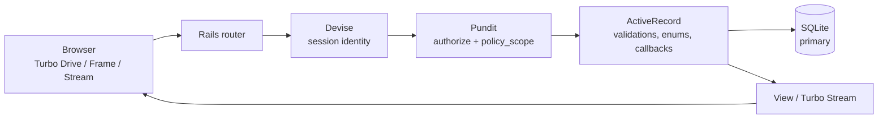
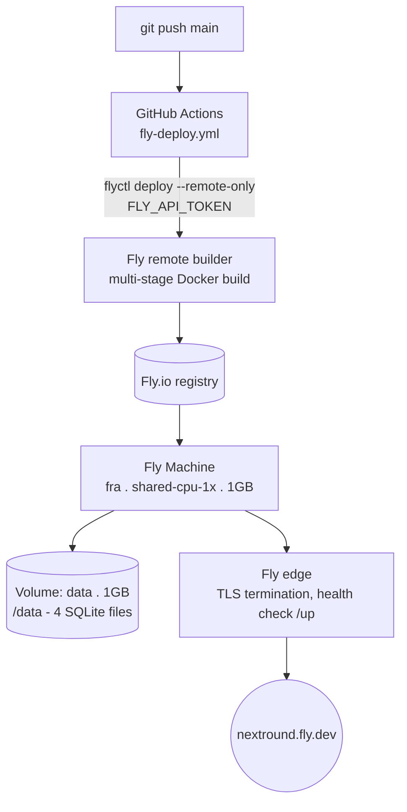

# NextRound — Architecture Description

Companion to the README: this covers the two things the brief asks for
specifically — data flow and deployment approach — in more depth than the
README's short version.

## Data flow

A page load or Turbo Frame request follows one path end to end.
Authorization happens twice on purpose: once to decide if the action is
allowed at all (`authorize`), and again to decide which *rows* are visible
(`policy_scope`) — so a candidate hitting `/interviews` doesn't get an
admin's query with a filter bolted on, they get a query that was never
capable of returning someone else's interview.

Three flows sit on top of that generic path and carry the app's actual
business logic:

| Flow | Mechanism |
|---|---|
| Template → interview | Starting an interview from an `InterviewTemplate` copies its `TemplateQuestion` rows into new `InterviewQuestion` rows (`Interview#copy_template_questions`). The interview never references the template at read time, so editing or deleting the template later can't retroactively change a past interview. |
| Status auto-advance | `scheduled → in_progress` fires from `InterviewQuestion#start_interview_on_first_answer` the moment a candidate's first answer is saved. `→ completed` is blocked by a model validation until a `Feedback` row exists. Nobody sets status by hand except for the cancel exception. |
| Split-field ownership | Interviewer and candidate write to the same `InterviewQuestion` row but different columns — enforced in `InterviewQuestionPolicy`, not just hidden in the form: the candidate's `update?` only passes while `answer` is still blank, so they can edit their own draft but not the interviewer's `covered`/`notes`, and not their own answer again after submitting. |

## Deployment approach

Deployment target is a single Fly.io Machine running the Rails 8 default
multi-stage Docker build (`ruby:3.4.2-slim`, assets and bootsnap
precompiled at build time, runs as a non-root `uid 1000` user). CI and CD
are two separate, independent GitHub Actions workflows on push to `main`
— Brakeman, an importmap dependency audit, and Rubocop run in `ci.yml`;
`fly-deploy.yml` deploys in parallel via `flyctl deploy --remote-only`,
authenticated with an `FLY_API_TOKEN` repo secret.

**The deploy does not currently wait on CI** — a push to `main` ships even
if lint or the security scan is still running or fails. That's an
acceptable tradeoff for a single-developer demo app; the fix for anything
beyond that is making `fly-deploy` a required check that depends on `ci`.

| Parameter | Value | Note |
|---|---|---|
| Region | `fra` | single region, no multi-region replicas |
| Machine | shared-cpu-1x, 1GB | `auto_stop_machines` — scales to zero when idle, cold-starts on the next request |
| Storage | 1GB volume, local to the machine | holds `production`, `_cache`, `_queue`, `_cable` SQLite files via `DATABASE_URL` |
| TLS | terminated at the Fly edge | `force_ssl` + `assume_ssl` set in `production.rb`; app never sees plain HTTP |
| Health check | `GET /up` every 10s | Rails' built-in health endpoint — 200 if the app boots clean |
| Secrets | `RAILS_MASTER_KEY` | only secret required; decrypts `config/credentials.yml.enc` |

## Scaling & the SQLite tradeoff

The load-bearing architectural bet here is SQLite on a single Fly volume,
in place of a networked database. It's the right call for what this app
is — one practice group, not concurrent traffic from many companies — and
it removes an entire class of setup (no Postgres to provision, connect
to, or pay for). It's also the first thing that would need to change if
that assumption stopped holding.

| Constraint | Why accepted now | Path past it |
|---|---|---|
| One writer at a time (SQLite file lock) | Low write concurrency — a handful of interviewers/candidates, not a multi-tenant SaaS | Move to Postgres — a `database.yml` + adapter gem change, not a rewrite, since ActiveRecord is already the only data-access layer |
| One machine, one region | The volume is local disk — a second machine can't share it | Postgres first, *then* horizontal scale; or Litestream/LiteFS if staying on SQLite matters more than horizontal scale |
| Cold start after idle (`auto_stop_machines`) | Free/near-free hosting for a practice tool beats always-on cost | Set `min_machines_running = 1` — one line in `fly.toml`, pure cost/latency dial |

## Security posture

- **No public signup surface.** Every account originates from an
  admin/interviewer invite; the only unauthenticated endpoint that
  mutates data is `/claim`, and it's rate-limited via `rack-attack`.
- **Invitation codes** are 16-digit, single-use, expire after 7 days, and
  are never emailed — nothing to intercept in transit.
- **Authorization is enforced server-side per field**, not just hidden in
  the UI (see the split-field ownership flow above) — verified by request
  specs covering the authorization boundary itself, not just the happy
  path.
- **Secrets never touch the image.** `RAILS_MASTER_KEY` is a Fly secret
  injected at runtime; assets are precompiled at build time with a dummy
  key specifically so the real one isn't needed in the build stage.
- **Runs as a non-root container user** (`uid 1000`), reducing blast
  radius if the app process were ever compromised.
